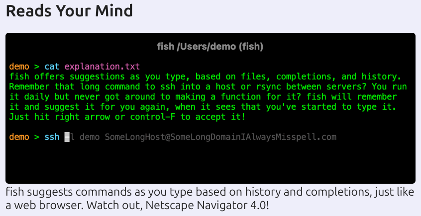
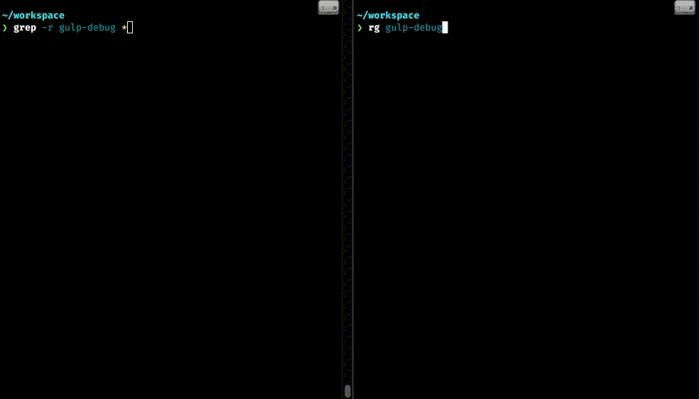

# Introduction

Are you still waiting for `grep` and `find` to show what you’re looking for? Can’t remember `find` syntax? Is your `ls` output bland? Tired of overconfiguring your `.zshrc` with too many plugins?

Let’s explore a few must-have utilities for daily workflows.

---

## fish – Finally, a command line shell for the 90s

- Smart autocompletion & syntax highlighting
- Now rewritten in Rust: [The Fish Of Theseus](https://fishshell.com/blog/rustport/)
- No POSIX compliance – Be free of legacy constraints

<!-- _footer: https://fishshell.com/ -->

---

## ripgrep (rg) – A blazing-fast alternative to `grep`

- Fast search tool built on top of Rust’s regex engine
- `.gitignore`-aware searching
- Example: `rg "error" src/` → searches recursively in source directory

<!-- _footer: https://github.com/BurntSushi/ripgrep -->

---

## fdfind (fd) – A simpler alternative to `find`

- Fast due to parallelized directory traversal (and Rust, obviously)
- Smart filename matching
- Ignore patterns from `.gitignore`
- Example: `fd "config" --type f` → find config files

<!-- _footer: https://github.com/sharkdp/fd -->

---

## bat – A `cat` clone with wings

- Git integration for modified files
- Colorful syntax highlighting – your code looks so good, you won’t want to run it
- Line numbering & pager support
- Example: `bat --style numbers file.js`

<!-- _footer: https://github.com/sharkdp/bat -->

---

## delta – A syntax-highlighting pager for git, diff, grep, and blame output

- Beautiful syntax highlighting for git and diff output
- Side-by-side view for git diffs – perfectly blame your colleagues in PR reviews
- Customizable themes and colors

<!-- _footer: https://github.com/dandavison/delta -->

---

## eza – A feature-rich replacement to `ls`

- Icons & colors to distinguish file types and metadata
- Human-readable sizes
- `eza --tree -L 2` – tree view with style and questionable performance on deep directories

<!-- _footer: https://github.com/eza-community/eza -->

---

## starship – The power of Rust in your prompt

- Works with any shell (bash, zsh, fish, and even cmd.exe??)
- Shows information you need (git status, language runtimes, battery level, phase of the moon, etc.)
- TOML configuration – looks 0.01% more amazing after 10 hours of config

<!-- _footer: https://github.com/starship/starship -->

---

## WezTerm – GPU-accelerated cross-platform terminal emulator and multiplexer

- GPU-accelerated rendering for smooth performance
- Built-in multiplexing (tabs, panes, windows) – no need for tmux/screen
- Configurable with Lua (spent nights customizing WoW addons? Now you can do the same during work hours)
- Cross-platform & written in Rust

<!-- _footer: https://github.com/wezterm/wezterm -->

---

# Conclusion

These tools will:
✅ Improve code discovery
✅ Enhance terminal experience
✅ Speed up your workflow (or not)

Use the right tools; don’t be a tool 🐟️
